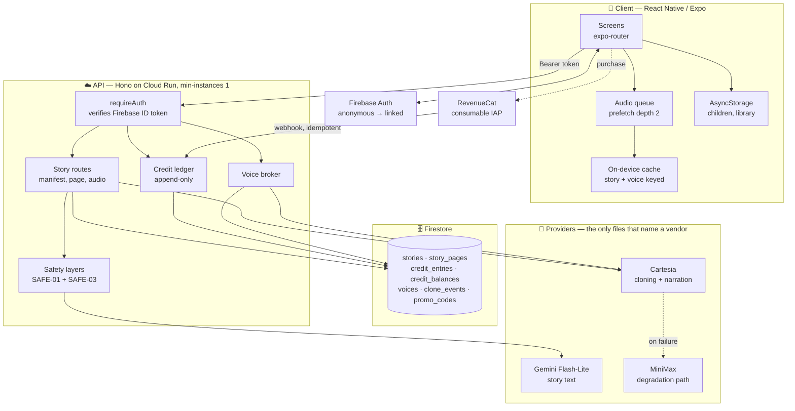
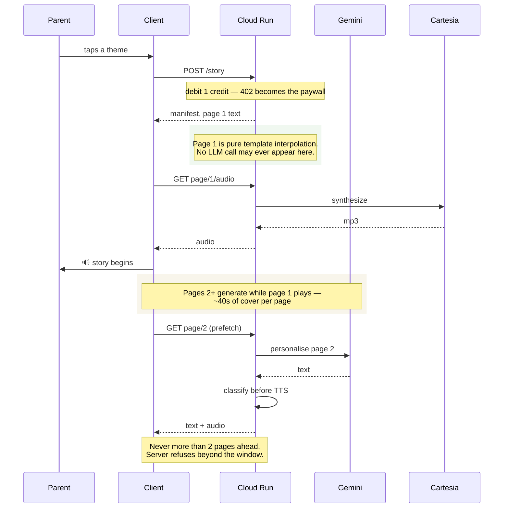
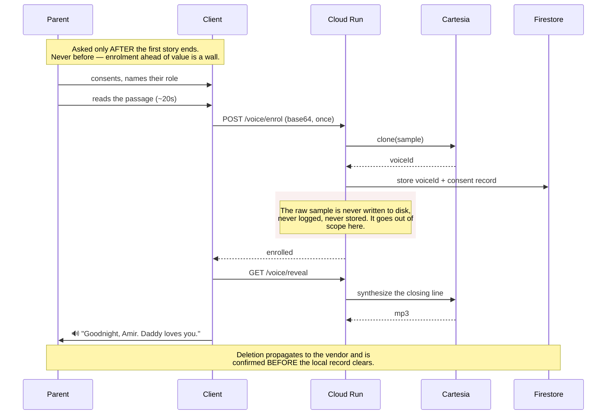
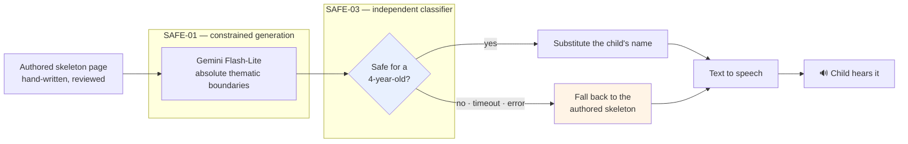

# Snugglee

A bedtime story where your child is the hero, narrated in your own voice — for
the nights you can't be there to read it yourself.

[**App Store**](https://apps.apple.com/us/app/snugglee/id6797722971) ·
[snugglee.app](https://www.snugglee.app)

Built for RevenueCat Shipaton 2026.

---

## The problem

Plenty of apps read stories to children. None of them sound like the person the
child actually wants. A parent records one short passage — about twenty seconds,
once — and from then on every story is generated for their child by name and
narrated in their own cloned voice.

Three constraints shaped every technical decision:

1. **A tired parent will not wait.** First audio has a 300ms budget from the
   moment a theme is tapped.
2. **Most stories are never finished** — a child asleep at page four is the
   product working. Pages nobody hears must never be generated or paid for.
3. **The listener is four years old.** There is no error state, no spinner, and
   nothing to tap.

---

## Architecture



Route handlers never name a vendor. The provider abstraction was written
*before* any vendor SDK was imported, which is what later allowed the entire
narration vendor to be swapped by changing one line.

---

## The critical path — tap to first audio



**Why the server refuses rather than trusting the client:** lazy generation is a
cost control, not a latency trick. A client that fetched the whole story up
front would silently undo it, so the ceiling is enforced server-side.

---

## Voice, and what happens to the recording



The closing line is authored per language, never machine-translated. In Malay,
Tagalog, Vietnamese, Korean, Japanese and Thai a parent speaking to a small
child uses a kinship term for *themselves* and there is no neutral form — so the
speaker's role is a required template slot, captured one tap before recording.
Without it, a father's cloned voice says *"Mother loves you"*.

---

## Content safety



Two properties matter more than the layers themselves:

- **The classifier sees the text alone** — no prompt, no child's name, no
  context. Context is what would let it rationalise a borderline page as
  intended.
- **It fails closed to authored text.** A timeout, a malformed response or an
  API error all count as unsafe. The fallback is a hand-written page the
  illustration was drawn for, so a rejection costs personalisation and never the
  story. A parent never sees an error at bedtime.

**The child's name never reaches the AI vendor.** Pages are generated with a
`{childName}` placeholder and the real name is substituted only after
generation and classification. The classifier never sees it either.

---

## Data model

| Collection | Holds | Keyed by |
|---|---|---|
| `credit_entries` | Append-only ledger. Balance is a sum, never a mutated field. | idempotency key |
| `credit_balances` | Cached sum. Only `append()` may write it. | uid |
| `stories` | Manifest, theme, and how far the child actually got | story id |
| `story_pages` | Generated page text, so replays cost nothing | `storyId__n` |
| `voices` | Vendor voice reference + timestamped consent. **Never the recording.** | uid |
| `clone_events` | Rate-limit trail for clone creation | auto |
| `promo_codes` | Support grants. Not reachable from the client. | code |

Every write that changes a balance runs in a transaction with the entry document
ID *as* the idempotency key, so a duplicate webhook collides into a no-op rather
than a second grant.

---

## Layout

| Directory | What it is |
|---|---|
| `mobile/` | React Native / Expo client (iOS + Android) |
| `server/` | Cloud Run API — story orchestration, credit ledger, voice broker |
| `web/` | Next.js landing page, privacy policy and terms |
| `harness/` | Throwaway bench used to evaluate vendors and prompts |
| `assets-pipeline/` | Build-time story authoring and illustration rendering |

## Running it

**Client**

```bash
cd mobile
npm install
npx expo start            # add --localhost for a simulator
```

Google Sign-In needs native code, so a development build is required —
`npx expo prebuild` then `eas build --profile development`.

**Server**

```bash
cd server
npm install
npm run typecheck
PORT=8787 npm run dev
```

Vendor credentials come from Secret Manager in production and are never bundled
into the client. See `server/README.md`.

**Pipeline** (only when adding or changing a story theme)

```bash
node assets-pipeline/author-skeletons.mjs   # write story skeletons
node assets-pipeline/render-art.mjs         # render illustrations
node assets-pipeline/optimise.mjs           # compress + bundle into the app
```

Skeletons are classified at authoring time as well as at runtime — a bad
skeleton would otherwise ship to every user. Regression tests live in
`harness/safety-tests/`.

---

## Decisions worth knowing about

**Cloud Run, not Cloud Functions.** A cold start consumes the entire 300ms
page-one budget. `min-instances=1` costs a few dollars a month and removes the
problem.

**Consumable credits, never a subscription.** A complete story costs **$0.247**
to produce, measured rather than modelled. A nightly reader is 365 × $0.247 =
~$90/year, which no subscription price a parent would accept can cover. Credits
align revenue with a marginal cost that is genuinely high. The first story is
free; replays are always free, forever.

**Anonymous first, account later.** A Firebase anonymous session is created
silently at launch — no wall before first value. Linking preserves the same uid,
so the ledger never migrates. Auth is persisted to AsyncStorage, because the JS
SDK defaults to in-memory on React Native and the uid *is* the key to everyone's
purchased credits.

**Art is pre-rendered per skeleton, not per story.** One-time cost, amortised
across every user — and language-neutral, which is what makes adding a language
cheap.

**Two design registers, one component library.** The shell (parent choosing,
lights on) and the player (child falling asleep) share components and differ
only in tokens. The palette was sampled from the generated artwork rather than
chosen: `#2C2C4D` is 34.4% of all pixels in the illustrations.

**The Custom Path is designed but not built.** `path: 'instant' | 'custom'`
exists in the manifest and the image provider is implemented, but no route calls
it. Every story today is the Instant Path: authored skeleton, per-page
personalisation, pre-rendered art.

---

## Notes

`_internal/` holds product strategy, unit economics, store copy and the schedule.
It is deliberately untracked.
